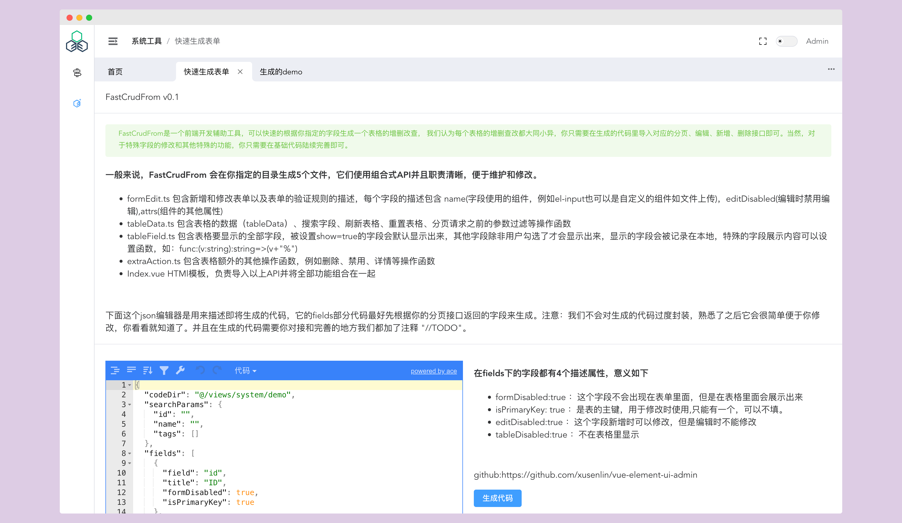

# Vue 3(ScriptSetup) + TS + Vite + ElementPlus + Pinia + VueRouter + Axios

> 番外： [MareWood](https://github.com/xusenlin/MareWood) 是一个 Go 开发的轻量级前端部署工具,可以很灵活的配置各种打包部署环境并提供访问,特别是远程的时候，方便后端和测试使用。

# 介绍
- 干净简单职责清晰的一个后台模板，开箱即用。
- 简单处理Axios以方便json、formData、文件上传的操作
- 表格增删改查代码自动生成，提供大部分表单验证
- 全部使用vue3 的单文件 ScriptSetup
- 尽量多的注释，直接上手开干一把梭。

# 系统一览

### Stores 

使用极轻的 Pinia 约 1kb，目前有 app 和 user 两个 stores,app 目前存储侧边栏开关、黑暗模式、tabsChrome的状态和内容，
user则需要你根据你的系统完善，他用来储存用户的token，权限等。

### Router

系统的路由除了提供页面之间的跳转还参与菜单的显示，菜单和路由一致，支持无限层级嵌套，并在路由配置的RouteMeta上扩展提供了描述菜单隐藏和权限等配置。

### FastCrudFrom

配合vite的插件功能，会在你指定的目录生成formEdit.ts、tableData.ts、tableField.ts、extraAction.ts、Index.vue，他们共同组成了
表格展示、分页、表格字段设置、新增、修改、删除等功能。利用此思路，我们可以自动根据api文档自动生成api代码，自动路由等。

### 打包环境
目前支持测试、预发布、本地、正式环境的打包，配置好相应的请求，打包自动选择。如果使用配合使用 MareWood ，那么我只负责提交分支和代码，任何分支和环境的预览地址都可以打包。

